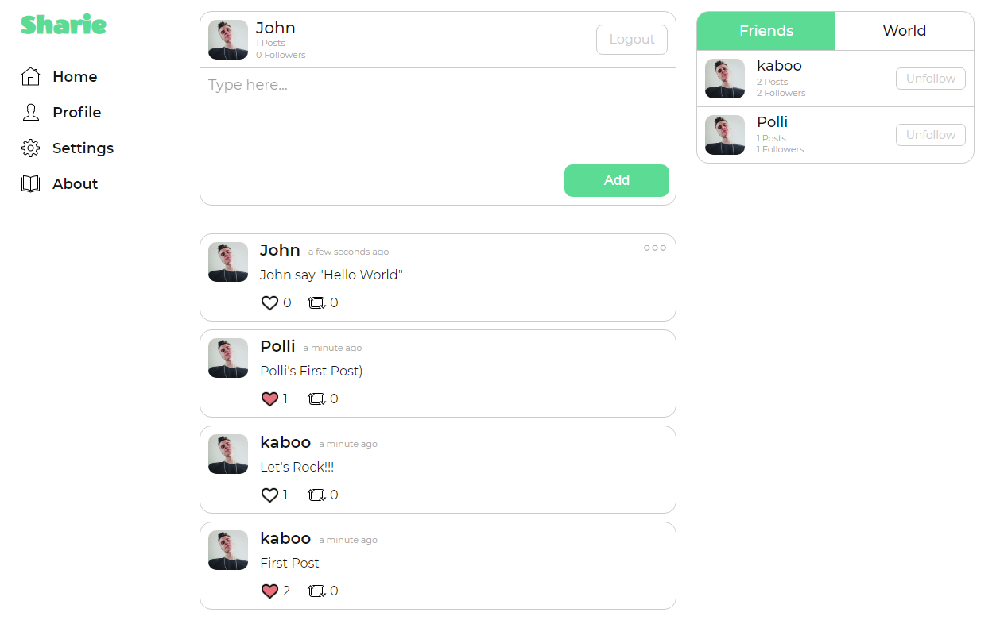
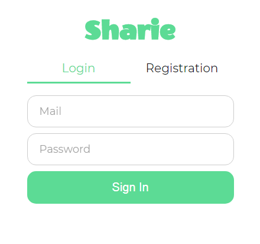

    

<h1 align="center">Social network 'Sharie'</h1>

[![Forks][forks-shield]][forks-url]
[![Issues][issues-shield]][issues-url]
[![MIT License][license-shield]][license-url]

### What is this?
+ MERN-stack social-network
+ Just my new technologies testing
+ Saving my progres on the GitHub repo

### How To Use
+ Clone this repo to your computer
+ "npm start" to run front-end (on port 3000)
+ "nodemon server" to run back-end (on port 5000)

 

 

<h3>Contact Me:</h3>

    
<b>Telegram:</b> @kaboo_bear 

    
<b>Gmail:</b> kaboo.bear@gmail.com 

    
<b>GitHub:</b> https://github.com/kaboobear

[forks-shield]: https://img.shields.io/github/forks/kaboobear/Social-Network?style=flat-square
[forks-url]: https://github.com/kaboobear/Social-Network/network/members
[issues-shield]: https://img.shields.io/github/issues/kaboobear/Social-Network.svg?style=flat-square
[issues-url]: https://github.com/kaboobear/Social-Network/issues
[license-shield]: https://img.shields.io/github/license/kaboobear/Social-Network.svg?style=flat-square
[license-url]: https://github.com/kaboobear/Social-Network/blob/master/LICENSE.txt
